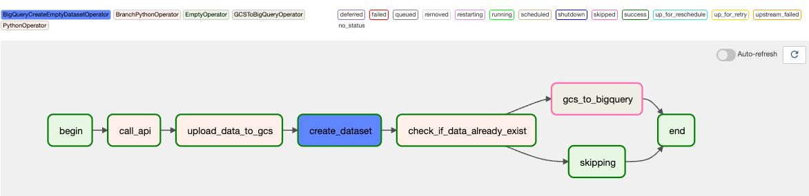
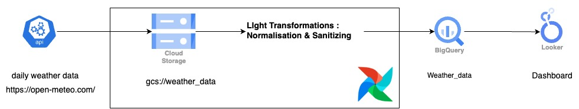
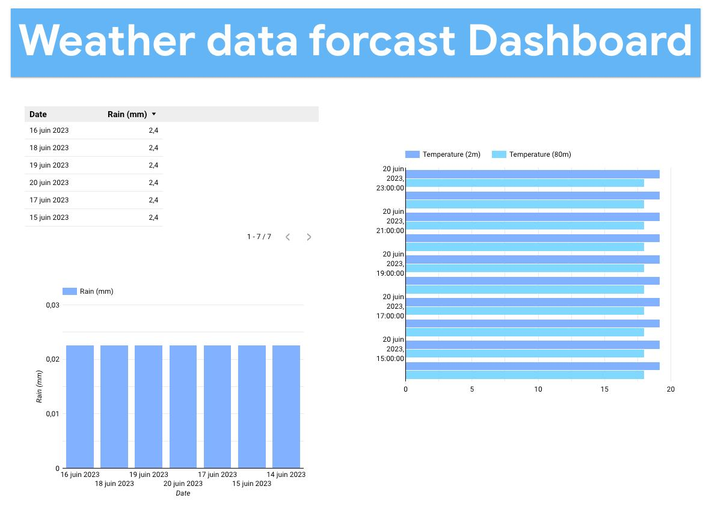
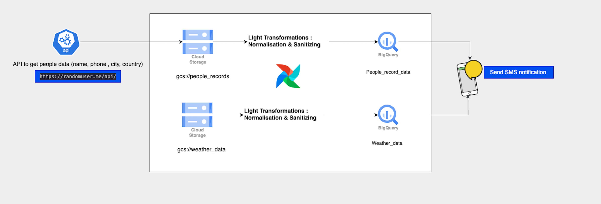
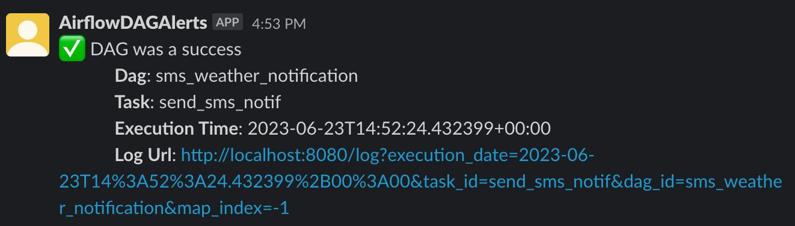
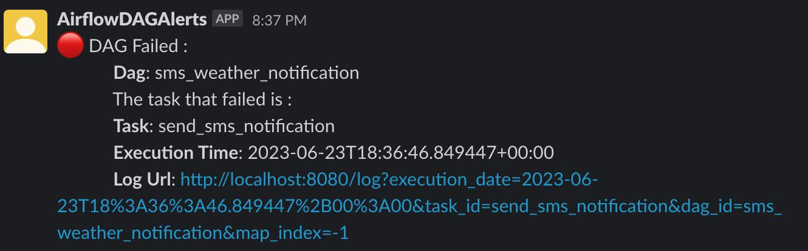

# Daily Weather data ETL pipeline scheduling and SMS notification sending using Airflow. With Dag monitoring Alerts.

**The stack used :**

   

**The DAGs :**

Overview
========

This project has 2 parts : 

* Part 1 : Schedules a daily call of daily Weather data by calling a Weather API and then loads the json data into a Google Cloud Storage Bucket. After that it puts the data into a BigQuery Table.

* Part 2 : Schedules a daily SMS notification to people in our data according to their city and country, containing a custommized message about the weather.
    - To make data for this project I used an API that gives me a data of random people's information. The payload contained different information but I unnested it to get only the information I needed (Name, Phone number, Phone code, City, Country...). And then I put this data into a GCS bucket and then to a Bigquery Table. Then The SMS is sent to the people who are in the table.

# Overall architecture :

Daily weather : 

My resulting Dashboard in Looker :

Weather SMS notification : 

# DAG Monitoring Alerts using a Slack Bot :

In order to keep monitoring the DAG to see weather it's working or not, I made a Bot that sends me alerts to see if the DAG worked or not, along side other info.

Project Contents
================

My project contains a "dags" folder : 
- This folder contains the Python files for my Airflow DAGs. It includes :

    -  **daily_weather_update_dag.py**
        
        The architecture of the DAG is as follows :

        - Begin : `EmptyOperator` 

        - data_to_gcs : `PythonOperator`

        - create_dataset : `BigQueryCreateEmptyDatasetOperator`

        - check_if_data_already_exist : `BranchPythonOperator`

        - gcs_to_bigquery_operator :  `GCSToBigQueryOperator`

        - skipping : `EmptyOperator`

        - End : `EmptyOperator`

     -  **sms_sender_dag.py**

         - Begin : `EmptyOperator` 

        - data_to_gcs : `PythonOperator`

        - create_dataset : `BigQueryCreateEmptyDatasetOperator`

        - gcs_to_bigquery_operator :  `GCSToBigQueryOperator`

        - send_sms_notification : `SlackAPIPostOperator`

        - End : `EmptyOperator`

